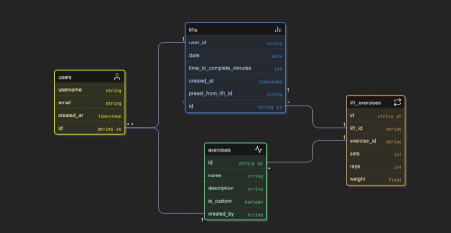

# Lifting Tracker

## Tech Stack
- **Frontend:** React, TypeScript, Vite
- **Backend:** FastAPI (Python 3.11)
- **Database:** PostgreSQL

## Package Managers
- **Frontend** - yarn
- **Backend** - uv

## Backend UML



## Entity Relationships
Workout = one training session
ExerciseInWorkout = one movement performed during that session
Set = one attempt with reps/weight for that exercise

### Example Output
```bash
"started_at": "2025-08-10T10:00:00",
  "notes": "Push day",
  "exercises": [
    {
      "exercise_id": "1f3e2b9a-12c3-4d4b-9f12-3c456789abcd",
      "sets": [
        { "set_number": 1, "reps": 8, "weight": 185 },
        { "set_number": 2, "reps": 8, "weight": 185 }
      ]
    },
    {
      "exercise_id": "6d21bbbc-a778-4e2b-b93d-8a67f2b8abcd",
      "sets": [
        { "set_number": 1, "reps": 10, "weight": 50 },
        { "set_number": 2, "reps": 10, "weight": 50 }
      ]
    }
  ]
}
```